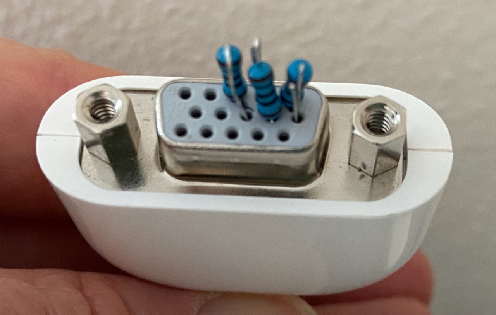

# linux
 Notes on Linux related things
 
## Running Ubuntu 20.04 Desktop headless on an old Mac Mini (2009 Core Duo)

1. Make the Mac Mini boot into a Desktop manager (GUI) without a monitor attached.

	The Mac Mini with Ubuntu will not boot into the Desktop GUI unless a monitor is attached.

	__Solution:__ Make the Mac Mini think a monitor is attached using the [solution posted by Nick O'Neill](http://blog.nickoneill.name/headless-mac-mini-with-ubuntu/). I used 100 ohm resistors and it works fine. This is the Mac monitor port to VGA dongle that came with the Mac Mini, into which I inserted 100 ohm resistors, one resistor between pins 1 and 6, one between 2 and 7, and one between 3 and 8.

	

1. Enable `vino-server` in Ubuntu

	- From the desktop, run __Settings > Sharing__.
	- Click __Screen Sharing__.
	- Slide the switch in the upper left corner of the __Screen Sharing__ window to the right to enable.
	- Check __Allowed connections to control the screen__.
	- Select __Require a password__.
	- Create a password for VNC access.
	- Close the __Screen Sharing__ window.
	
1. Copy the `xrandr.sh` script into `/usr/local/bin/`. The `xrandr.sh` script is from [chirag64](https://gist.github.com/chirag64/7853413). 
1. Make it executable

		chmod +x xrandr.sh
		
1. As root (sudo), open `/usr/lib/systemd/user/vino-server.service` in an editor

1. Add a `ExecStartPre=...` line as shown after the `ExecStart=...` line, so the file looks like this (change resolution and frequency as needed):

		[Unit]
		Description=Vino VNC server
		
		[Service]
		Type=dbus
		BusName=org.gnome.Vino
		ExecStart=/usr/lib/vino/vino-server
		ExecStartPre=-/usr/local/bin/xrandr.sh 1920 1080 60
		Restart=on-abnormal
 
1. As root (sudo), open `/etc/gdm3/custom.conf` in an editor.
1. Locate the `# Enabling automatic login` line and uncomment the 2 lines after it so it looks like this (change the username to the user you want to have autologin):

		# Enabling automatic login
		AutomaticLoginEnable = true
		AutomaticLogin = steve
		
1. Reboot.
1. Use RealVNC viewer to connect to your Mac Mini by name or IP address.

